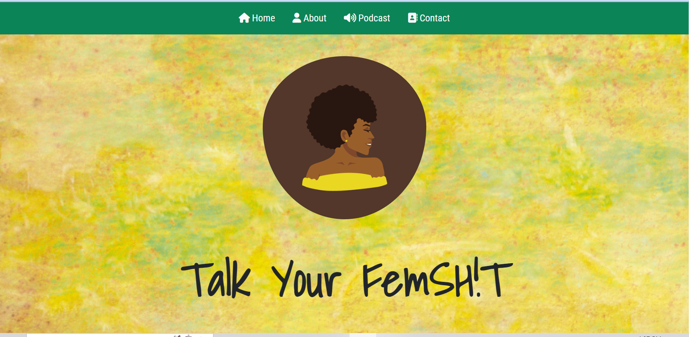

# Talk Your FemSH!T Podcast Site

## Podcast website that will generate traffic from diverse women to safely speak their thoughts. 

### Libraries, Frameworks, and Languages Used

- Bootstrap
- jQuery
- Popper
- JavaScript
- SASS
- HTML
- Fonts Awesome

### Homepage

The homepage features the following:

- Navbar 
- Two sections with paragraphs and a button
- Footer
- Social Links 

